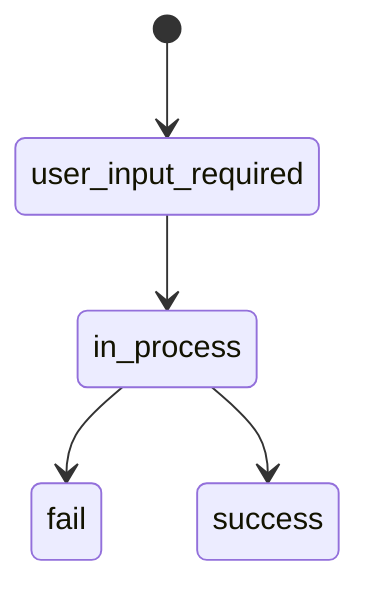

## Формат ответа при ошибке

Все ошибки API возвращаются в едином формате:

```json
{
    "success": false,
    "error": {
        "details": "Описание ошибки",
        "code": "КОД_ОШИБКИ"
    },
    "trace_id": "уникальный_идентификатор_запроса"
}
```

<ParamField body="success" type="boolean">
  Всегда `false` при ошибке
</ParamField>

<ParamField body="error.code" type="string">
  Код ошибки (см. таблицу ниже)
</ParamField>

<ParamField body="error.details" type="string">
  Подробное описание причины ошибки
</ParamField>

<ParamField body="trace_id" type="string">
  Уникальный идентификатор запроса для диагностики. Укажите его при обращении в поддержку.
</ParamField>

---

## HTTP-статусы

| Статус | Описание | Когда возникает |
|--------|----------|-----------------|
| `200`  | Успех | Операция выполнена успешно |
| `400`  | Неверный запрос | Некорректные параметры, невалидные значения полей |
| `401`  | Не авторизован | Неверные или отсутствующие учётные данные |
| `404`  | Не найден | Несуществующий эндпоинт или попытка GET-запроса вместо POST |
| `405`  | Метод не разрешён | Использование неправильного HTTP-метода |
| `500`  | Ошибка сервера | Внутренняя ошибка на стороне API |

---

## Коды ошибок API

### Ошибки аутентификации

| Код | Описание | Решение |
|-----|----------|---------|
| `UNAUTHORIZED` | Неверные аутентификационные данные | Проверьте `login` и `password` в Basic-авторизации |

### Ошибки валидации

| Код | Описание | Решение |
|-----|----------|---------|
| `BAD_REQUEST` | Ошибка валидации входных данных | Проверьте все обязательные поля и допустимые значения |

<Info>
  При ошибке валидации поле `error.details` содержит JSON-массив с подробным описанием каждого невалидного поля, включая полученное значение и список допустимых значений.
</Info>

### Ошибки маршрутизации

| Код | Описание | Решение |
|-----|----------|---------|
| `NOT_FOUND` | Эндпоинт не найден | Убедитесь, что используете POST-метод и корректный URL |

---

## Статусы операций (callbacks)

При обработке уведомлений (callbacks) статус операции передаётся в поле `current_status`:



| Статус | Описание |
|--------|----------|
| `user_input_required` | Ожидание направления пользователя на платёжную страницу |
| `in_process` | Операция в процессе обработки |
| `success` | Операция завершена успешно |
| `fail` | Операция завершена с ошибкой |

---

## Коды ошибок операций

Эти коды передаются в callback-уведомлениях в случае неуспешного завершения операции:

| Код | Описание |
|-----|----------|
| `SUCCESS` | Операция проведена успешно |
| `PROCESSING_INSUFFICIENT_FUNDS` | Недостаточно средств на карте |
| `PROCESSING_3D_SECURE_FAILED` | Ошибка 3D Secure подтверждения |
| `PROCESSING_3D_SECURE_CANCELLED` | 3D Secure отменён пользователем |
| `PROCESSING_DECLINED` | Операция отклонена процессингом |
| `PROCESSING_TIMEOUT` | Превышено время ожидания |
| `PROCESSING_ERROR` | Общая ошибка процессинга |

<Tip>
  Для тестирования различных сценариев используйте [тестовые карты](/api-reference/integration/checkout#тестовые-карты) с разными CVV-кодами.
</Tip>

---

## Рекомендации по обработке ошибок

<Steps>
  <Step title="Логируйте trace_id">
    Сохраняйте `trace_id` из каждого ответа API. Это значительно ускорит диагностику проблем при обращении в поддержку.
  </Step>
  <Step title="Обрабатывайте все HTTP-статусы">
    Не полагайтесь только на `200`. Реализуйте обработку `400`, `401`, `404` и `500` ответов.
  </Step>
  <Step title="Используйте retry с экспоненциальной задержкой">
    При получении `500` ошибки повторите запрос через 1, 2, 4 секунды. Не повторяйте `400` и `401` — они требуют исправления параметров.
  </Step>
  <Step title="Проверяйте подпись callbacks">
    Всегда проверяйте подпись уведомлений. Подробнее — в разделе [Обратные уведомления](/api-reference/integration/callbacks).
  </Step>
</Steps>
