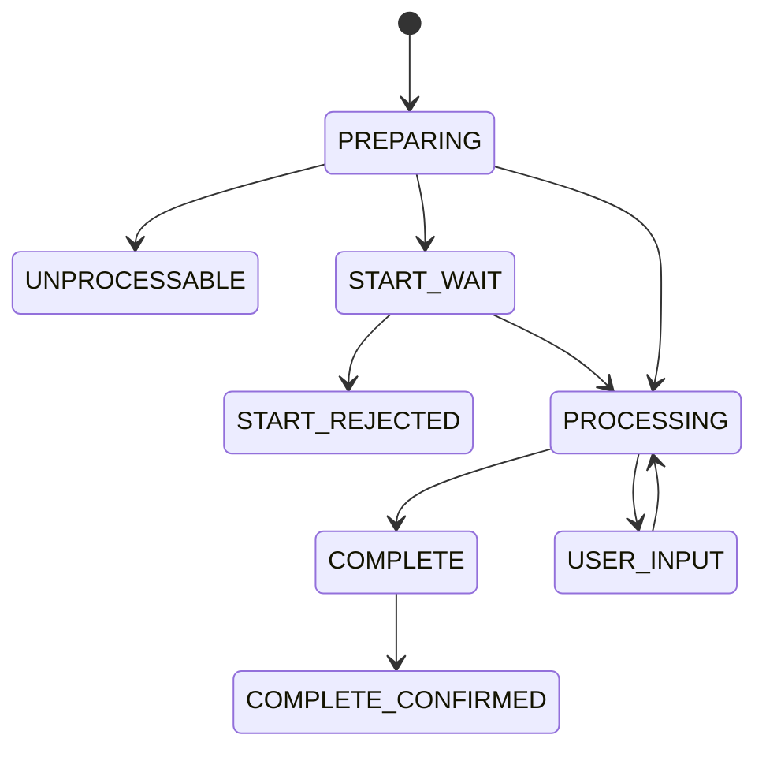

Generic Withdrawal API — это **универсальный API для фиатных выплат**, который:

- поддерживает **несколько методов выплаты** (банковские карты, SEPA по IBAN и др.) через объект `recipient_payment_method`;
- наследует **модель жизненного цикла, статусы и идемпотентность** от Card Withdrawal API;
- предоставляет единый контракт для разных payout‑сценариев.

<Info>
Generic Withdrawal API построен поверх той же статусной модели, что и Card Withdrawal API (`PREPARING → START_WAIT → PROCESSING → USER_INPUT → COMPLETE → COMPLETE_CONFIRMED`) и использует те же принципы идемпотентности по `client_operation_id`.
</Info>

## Ключевые особенности

- **Единый ответный контракт**: на верхнем уровне всегда есть `success`, `trace_id`, `result` или `error`.
- **HTTP 200 OK всегда для логически успешного и логически неуспешного ответа** — различия только в `success` и `error`.
- **Идемпотентность** всех методов по `client_operation_id` (для команд, меняющих состояние).

Примеры ответов:

```json
{
  "success": true,
  "trace_id": "260498e19c04410fb67de6093b8218b2",
  "result": {}
}
```

```json
{
  "success": false,
  "trace_id": "085e44116fcd4bde9862d903e43ec3cc",
  "error": {
    "code": "BAD_REQUEST",
    "details": "Missing required parameter."
  }
}
```

## Аутентификация и безопасность

### Basic auth

Все методы Generic Withdrawal API используют **HTTP Basic authentication**:

```http
Authorization: Basic base64(username:password)
```

Пара `username` + `password` выдается менеджером интеграции.  
Для проверки корректности учётных данных и доступности сервиса используйте:

```http
POST /public/api/withdraw/generic/v2/check_health
```

Тело запроса — произвольный JSON объект, ответ в случае успеха:

```json
{
  "success": true,
  "trace_id": "d33359866ec888f426d2bee748b76ff6"
}
```

### Дополнительная защита

- **Ограничение IP‑адресов** отправителя (white‑list).
- **Подпись запросов** (RSA / ECDSA) с заголовками:
  - `X-RSA-KEY-ID`, `X-RSA-NONCE`, `X-RSA-SHA256-SIGN`
  - `X-ECDSA-KEY-ID`, `X-ECDSA-SHA256-SIGN`

Алгоритмы подписи и проверки подробно описаны в разделе интеграции; при необходимости их можно реализовать по примерам из спецификации.

## Методы выплаты (`recipient_payment_method`)

Способ получения средств задаётся через объект `recipient_payment_method`. Внутри него **должен быть указан ровно один** метод выплаты:

- `bank_card` — выплата на банковскую карту;
- `sepa_account` — выплата по IBAN (SEPA).

Примеры:

```json
{
  "recipient_payment_method": {
    "bank_card": {
      "pan": "4444 4444 4444 0008",
      "cardholder": "JOHN SMITH",
      "expiration_month": 3,
      "expiration_year": 2033
    }
  }
}
```

```json
{
  "recipient_payment_method": {
    "sepa_account": {
      "iban": "DE89370400440532013000"
    }
  }
}
```

<Warning>
Состав и обязательность полей внутри конкретного метода выплаты зависят от настроек интеграции и могут отличаться между проектами.
</Warning>

## Статусная модель

Generic Withdrawal API использует ту же статусную диаграмму, что и Card Withdrawal API:



Кратко:

- `PREPARING` — асинхронная подготовка, проверка возможности выплаты;
- `UNPROCESSABLE` — выплата невозможна, исполнение не начиналось;
- `START_WAIT` — ожидание явного запуска;
- `PROCESSING` — исполнение выплаты на стороне сервиса;
- `USER_INPUT` — требуется участие конечного пользователя;
- `COMPLETE` — исполнение завершено (успех / частичный успех / ошибка);
- `COMPLETE_CONFIRMED` — партнёр подтвердил обработку результата.

Причины неуспешного исполнения описаны через `failure_details` (`NO_SUITABLE_METHODS`, `INSUFFICIENT_BALANCE`, `PROVIDER_PROCESSING_ERROR` и др.) и полностью совпадают с моделью, описанной для Withdrawal API.

## Основные методы Generic Withdrawal API

### Проверка доступности

```http
POST /public/api/withdraw/generic/v2/check_health
```

Используется для проверки:

- корректности учётных данных;
- доступности сервиса.

### Проверка баланса

```http
POST /public/api/withdraw/generic/v2/get_balance
```

Запрос:

```json
{
  "project_id": "check"
}
```

Ответ содержит:

- список субсчетов (`sub_accounts`);
- общий доступный баланс и источники ликвидности для каждого субсчёта.

### Создание выплаты (автоматический выбор источника)

```http
POST /public/api/withdraw/generic/v2/create_operation
```

Ключевые поля запроса:

- `client_operation_id` — идемпотентный ключ операции;
- `user` — данные конечного пользователя;
- `recipient_payment_method` — карта или SEPA;
- `order_amount` — сумма и валюта;
- `url_callback` — адрес для вебхуков;
- флаги `disallow_end_user_interaction`, `disallow_transaction_split`, `await_preparing`.

В ответе возвращается актуальное `operation_state` с полным состоянием выплаты (включая токенизированные реквизиты).

### Создание выплаты с явным источником

```http
POST /public/api/withdraw/generic/v2/create_operation_using_explicit_source
```

Отличается от предыдущего метода дополнительным полем:

- `liquidity_source_id` — явный выбор источника ликвидности.

### Получение состояния выплаты

```http
POST /public/api/withdraw/generic/v2/get_operation_state
```

Запрос по `client_operation_id`, ответ — текущее `operation_state`.  
Особый случай ошибки — `OPERATION_NOT_FOUND`.

### Запуск выплаты

```http
POST /public/api/withdraw/generic/v2/start_operation
```

Переводит выплату из `START_WAIT` в `PROCESSING`. При некорректном состоянии — `UNACCEPTABLE_COMMAND`.

### Отмена выплаты

```http
POST /public/api/withdraw/generic/v2/abort_operation
```

При успехе операция попадает в `COMPLETE` с `result_status` `FAILURE` или `PARTIAL_SUCCESS`.  
Особый код `ACCEPTED_WITHOUT_OBLIGATIONS` означает, что отмена возможна только при дальнейшем неблагоприятном исходе на стороне провайдера.

### Подтверждение завершения

```http
POST /public/api/withdraw/generic/v2/confirm_operation
```

Используется после того, как партнёр обработал результат выплаты на своей стороне.  
Переводит выплату в `COMPLETE_CONFIRMED`.

### Открытие интерфейса для пользователя

```http
POST /public/api/withdraw/generic/v2/open_operation_user_input
```

Возвращает:

- `operation_state`;
- `user_input_parameters` c полями `url`, `concurrency_stamp`, `requested_at`, `url_redirect`.

Используется для сценариев, где требуется интерактив (3‑DS и др.).

## Уведомления

Сервис отправляет вебхуки при ключевых переходах состояния (`UNPROCESSABLE`, `START_WAIT`, `START_REJECTED`, `USER_INPUT`, `COMPLETE` и др.) с типом сообщения, совместимым с карточными выплатами (например, `card_withdrawal_state`), а в `payload` — полный `operation_state`.

<Check>
Надёжная интеграция должна совмещать:

- обработку уведомлений о смене состояний;
- периодический опрос `/get_operation_state` по всем незавершённым выплатам.
</Check>

