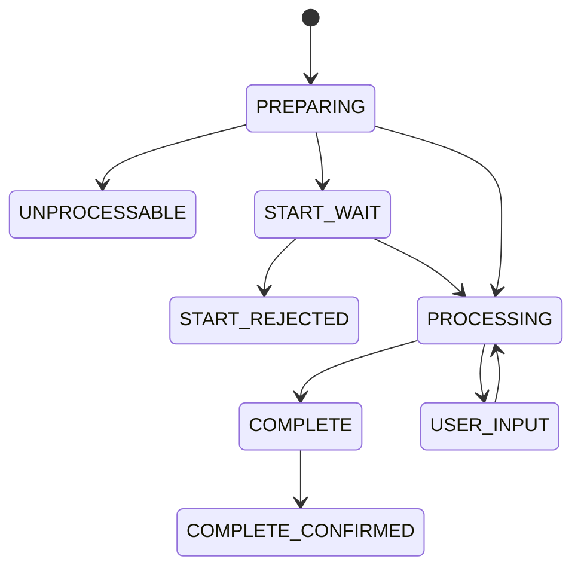

Данный API предназначен для выполнения **фиатных выплат** конечным пользователям с поддержкой **различных методов выплаты** (банковские карты, SEPA по IBAN и др.).

API является расширением Card Withdrawal API (`/public/api/withdraw/card/v2`) и использует ту же статусную модель, жизненный цикл операций и принципы идемпотентности.

Спецификация API доступна в виде OpenAPI 3.0 (Swagger) документа, получить его можно у менеджера интеграции.

## Общая информация об API

API выполнен в виде набора HTTP методов, полезная нагрузка в запросах/ответах передается в виде JSON в кодировке UTF-8. Все методы используют HTTP метод `POST` и являются идемпотентными если не указано обратное.

В каждом ответе API на верхнем уровне всегда содержится поле `success` типа `boolean`, для успешных ответов значение установлено в `true`, для неуспешных - `false`. HTTP код ответа для успешных запросов - всегда `200 OK`.

Пример ответа успешно выполненного запроса:

```json
{
  "success": true,
  // уникальный идентификатор запроса, полезен при обращении в поддержку
  "trace_id": "260498e19c04410fb67de6093b8218b2",
  // тип результата может отличаться для разных методов API,
  // для каждого метода тип result всегда один
  "result": {}
}
```

Пример ответа неуспешно выполненного запроса:

```json
{
  "success": false,
  "trace_id": "085e44116fcd4bde9862d903e43ec3cc",
  "error": {
    // код ошибки,
    // список кодов отличается для каждого метода
    "code": "BAD_REQUEST",
    // текстовое описание ошибки, предназначено для разработчиков, его 
    // не стоит передавать конечным пользователям
    "details": "Missing required parameter."
  }
}
```

Общие коды ошибок для всех методов API:

- `MAINTENANCE` - сервис находится на техническом обслуживании и не принимает запрос к исполнению. Запрос гарантированно не изменил состояние на сервере. Вызывающая сторона _может_ попробовать повторить запрос позднее.
- `INTERNAL_ERROR` - внутренняя ошибка на стороне сервиса, клиенту следует повторить запрос и обратиться в поддержку при повторении ошибок. Эта ошибка **не означает, что команда не была выполнена**, если такая ошибка была получена для запроса, _изменяющего состояние на сервере_ (например, создание платежа), для правильного продолжения работы клиент **должен** получить актуальное состояние на стороне сервера и принимать решение о дальнейшей обработке исходя из него.
- `UNAUTHORIZED` - ошибка аутентификации или авторизации, клиенту следует проверить учетные данные и детали интеграции. Запрос гарантированно не изменил состояние на сервере.
- `BAD_REQUEST` - запрос не прошел валидацию параметров, подробное описание можно получить в `details`. Запрос гарантированно не изменил состояние на сервере.
- каждый метод API может иметь дополнительные коды ошибок в дополнение к описанным выше.

Если клиент получил ответ с HTTP кодом не `200 OK` или структура ответа не совпадает с описанной выше - эту ситуацию нужно обрабатывать также как ответ с ошибкой `INTERNAL_ERROR`.

Если клиент не получил ответ за свой запрос (например, транспортная ошибка или тайм-аут) - эту ситуацию тоже необходимо обрабатывать как ответ с ошибкой `INTERNAL_ERROR`.

## Совместимость и миграция с Card API

Generic Withdrawal API разработан как расширение существующего Card Withdrawal API и использует ту же модель жизненного цикла операций, статусы и принципы идемпотентности.

Переход со старого Card Withdrawal API на Generic Withdrawal API может осуществляться **постепенно**:

- существующие интеграции с Card Withdrawal API продолжают работать без изменений;
- новые выплаты могут быть реализованы через Generic Withdrawal API параллельно со старыми.

## Методы выплаты (recipient\_payment\_method)

Способ получения средств задаётся через объект `recipient_payment_method`.

Внутри этого объекта должен быть указан **ровно один** метод выплаты. Одновременное указание нескольких методов не допускается.

Поддерживаемые методы выплаты:

- `bank_card` — выплата на банковскую карту
- `sepa_account` — выплата на банковский счёт по IBAN

В будущем список поддерживаемых методов может быть расширен без изменения основного контракта API.

Пример `recipient_payment_method` для выплаты на карту:

```json
{
  "recipient_payment_method": {
    "bank_card": {
      "pan": "4444 4444 4444 0008",
      "cardholder": "JOHN SMITH",
      "expiration_month": 3,
      "expiration_year": 2033
    }
  }
}
```

Пример `recipient_payment_method` для выплаты по SEPA:

```json
{
  "recipient_payment_method": {
    "sepa_account": {
      "iban": "DE89370400440532013000"
    }
  }
}
```

> ВАЖНО! Состав и обязательность полей внутри конкретного метода выплаты определяется выбранным методом и может отличаться для разных интеграций.

## Среды

API доступен в нескольких тестовых и продуктовых средах. В тестовых средах имеется набор тестовых банковских карт, с помощью которых эмулируются различные ситуации процессинга выплаты.

Выбор среды, выдача учетных данных, списка тестовых карт и информации по платежным методам осуществляется менеджером интеграции.

## Работа с субаккаунтами

Сервис предоставляет партнерам-агрегаторам передавать информацию о своих субаккаунтах, они именуются _проектами_ (`project_id`). Использование этой функции должно быть предварительно согласовано с менеджером интеграции.

По умолчанию субаккаунты не используются, значение `project_id` привязывается к учетным данным. В случае использования субаккаунтов подобной привязки может не быть и поле `project_id` в запросах становится обязательным.

> ВАЖНО! идентификаторы пользователей (`user_id`) и платежей (`client_operation_id`) уникальны только в рамках своего проекта (`project_id`), поэтому платежи с одинаковыми `client_operation_id` и разными `project_id` являются разными платежами. Составной ключ (`project_id`,`client_operation_id`) однозначно идентифицирует платеж, аналогично с пользователями.

## Статусная модель

Операция выплаты имеет следующую статусную модель:



| статус | описание |
| --: | :-- |
| `PREPARING` | асинхронная подготовка операции к исполнению. |
| `UNPROCESSABLE` | операция не взята в работу, исполнения не было |
| `START_WAIT` | ожидается подтверждение запуска исполнения |
| `START_REJECTED` | запуск операции не был подтвержден, явно или по тайм ауту |
| `PROCESSING` | исполнение выплаты происходит асинхронно на стороне сервиса, никаких активных действий не требуется |
| `USER_INPUT` | для исполнения выплаты требуется взаимодействие с конечным пользователем. Подробнее см. ниже. |
| `COMPLETE` | исполнение выплаты полностью завершено (успешно/неуспешно/частично) |
| `COMPLETE_CONFIRMED` | факт завершения выплаты подтвержден партнером |

Только что созданная операция попадает в состояние `PREPARING`. При нахождении в этом состоянии проверяется возможность осуществления выплаты. Никаких активных действий не требуется: только ожидание и периодическая проверка состояния.

> При использовании флага `await_preparing` запрос создания выплаты будет обрабатываться синхронно и ответ вернётся только после завершения стадии `PREPARING` с переходом в `START_WAIT` или `UNPROCESSABLE`.

Если в результате подготовки к выплате обнаруживается невозможность ее исполнения, операция переходит в терминальное состояние `UNPROCESSABLE`.

Если же выплата может быть исполнена успешно, то операция переходит в состояние `START_WAIT`. Для начала ее исполнения необходимо явно запустить выплату с помощью вызова API. Этот вызов желательно выполнить как можно скорее, чтобы предположение об успешном исполнении не устарело. Кроме того можно явным образом отказаться от исполнения выплаты, в этом случае она перейдет в состояние `START_REJECTED`.

После явного запуска выплаты она переходит в состояние `PROCESSING`. В этом состоянии никаких активных действий не требуется: только ожидание и периодическая проверка состояния.

Как правило, для исполнения выплаты не требуется интерактив с конечным пользователем. Тем не менее, иногда такое участие может понадобиться для успешного завершения операции. Если интерактив с конечным пользователем в процессе выплаты категорически неприемлем, то его можно явным образом запретить при создании операции. Если же запрет не установлен, то выплата _может_ перейти в состояние `USER_INPUT`, в котором понадобится перенаправить конечного пользователя на страницу сервиса (для получения адреса понадобится вызвать API). Переход `PROCESSING` и `USER_INPUT` в некоторых случаях может произойти несколько раз.

> **ВАЖНО**: состояние `USER_INPUT` в настоящий момент не возникает в процессе выплаты, но будет реализовано позже. Используйте явный отказ от этого состояния при создании выплаты если обработка этого состояния невозможна.

Когда выплата завершает свое исполнение, она попадает в состояние `COMPLETE`. В этом состоянии выплата может быть:

- полностью успешно исполнена - пользователю выплачена вся сумма заказа
- частично исполнена - удалось выплатить только часть суммы (от возможности частичного исполнения можно отказаться при создании выплаты)
- не исполнена совсем по различным причинам

Когда выплата завершается на стороне сервиса, это не дает никаких гарантий того что партнер узнал об этом. Поэтому для устранения такой несогласованности имеется еще одно состояние - `COMPLETE_CONFIRMED`. Переход `COMPLETE` -\>  `COMPLETE_CONFIRMED` осуществляется с помощью явного вызова API. Вызывать этот метод необходимо после изменения состояния выплаты на _вызывающей_ стороне.

## Источники ликвидности

Для того чтобы осуществить выплату, требуются выделенные партнеру средства на стороне сервиса. Для работы с ними используется понятия _источника ликвидности_. Единовременно могут быть доступны несколько источников ликвидности, каждый из которых может содержать средства в нескольких валютах.

При создании выплаты поддерживаются 2 сценария:

- с автоматическим выбором источника ликвидности
- с явным указанием источника ликвидности, он передается в запросе. Процедуру выбора источника необходимо обговаривать с менеджером интеграции.