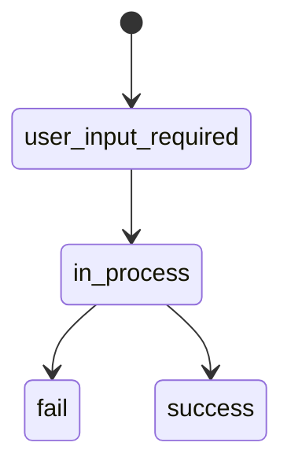

## Error Response Format

All API errors are returned in a unified format:

```json
{
    "success": false,
    "error": {
        "details": "Error description",
        "code": "ERROR_CODE"
    },
    "trace_id": "unique_request_identifier"
}
```

<ParamField body="success" type="boolean">
  Always `false` on error
</ParamField>

<ParamField body="error.code" type="string">
  Error code (see table below)
</ParamField>

<ParamField body="error.details" type="string">
  Detailed description of the error cause
</ParamField>

<ParamField body="trace_id" type="string">
  Unique request identifier for diagnosis. Provide it when contacting support.
</ParamField>

---

## HTTP Statuses

| Status | Description | When it occurs |
|--------|-------------|----------------|
| `200`  | Success | Operation completed successfully |
| `400`  | Bad Request | Incorrect parameters, invalid field values |
| `401`  | Unauthorized | Invalid or missing credentials |
| `404`  | Not Found | Non-existent endpoint or attempt to use GET instead of POST |
| `405`  | Method Not Allowed | Using incorrect HTTP method |
| `500`  | Server Error | Internal error on API side |

---

## API Error Codes

### Authentication Errors

| Code | Description | Solution |
|------|-------------|----------|
| `UNAUTHORIZED` | Invalid authentication data | Check `login` and `password` in Basic authorization |

### Validation Errors

| Code | Description | Solution |
|------|-------------|----------|
| `BAD_REQUEST` | Input data validation error | Check all required fields and valid values |

<Info>
  In case of a validation error, the `error.details` field contains a JSON array with a detailed description of each invalid field, including the received value and a list of valid values.
</Info>

### Routing Errors

| Code | Description | Solution |
|------|-------------|----------|
| `NOT_FOUND` | Endpoint not found | Ensure you use POST method and correct URL |

---

## Operation Statuses (Callbacks)

When processing notifications (callbacks), the operation status is passed in the `current_status` field:



| Status | Description |
|--------|-------------|
| `user_input_required` | Waiting for user redirection to payment page |
| `in_process` | Operation in processing |
| `success` | Operation completed successfully |
| `fail` | Operation failed |

---

## Operation Error Codes

These codes are passed in callback notifications in case of unsuccessful operation completion:

| Code | Description |
|------|-------------|
| `SUCCESS` | Operation completed successfully |
| `PROCESSING_INSUFFICIENT_FUNDS` | Insufficient funds on card |
| `PROCESSING_3D_SECURE_FAILED` | 3D Secure confirmation error |
| `PROCESSING_3D_SECURE_CANCELLED` | 3D Secure cancelled by user |
| `PROCESSING_DECLINED` | Operation declined by processing |
| `PROCESSING_TIMEOUT` | Timeout exceeded |
| `PROCESSING_ERROR` | General processing error |

<Tip>
  To test various scenarios, use [test cards](/en/api-reference/integration/checkout#test-cards) with different CVV codes.
</Tip>

---

## Error Handling Recommendations

<Steps>
  <Step title="Log trace_id">
    Save `trace_id` from every API response. This will significantly speed up problem diagnosis when contacting support.
  </Step>
  <Step title="Handle all HTTP statuses">
    Do not rely only on `200`. Implement handling of `400`, `401`, `404`, and `500` responses.
  </Step>
  <Step title="Use retry with exponential backoff">
    When receiving `500` error, retry the request after 1, 2, 4 seconds. Do not retry `400` and `401` — they require parameter correction.
  </Step>
  <Step title="Verify callback signature">
    Always verify notification signature. More details in [Callback Notifications](/en/api-reference/integration/callbacks).
  </Step>
</Steps>
