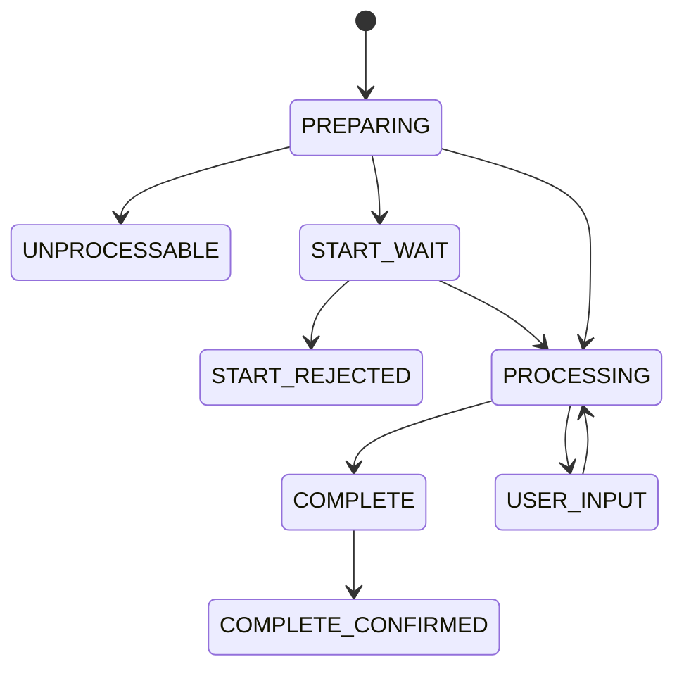

The Generic Withdrawal API is a **unified API for fiat payouts** that:

- supports **multiple payout methods** (bank cards, SEPA via IBAN, etc.) via `recipient_payment_method`;
- reuses the **same lifecycle, statuses, and idempotency model** as the Card Withdrawal API;
- provides a single contract for different payout scenarios.

<Info>
The Generic Withdrawal API shares the same status model as the Card Withdrawal API  
(`PREPARING → START_WAIT → PROCESSING → USER_INPUT → COMPLETE → COMPLETE_CONFIRMED`) and the same idempotency guarantees based on `client_operation_id`.
</Info>

## Core response contract

All methods:

- use JSON over HTTP `POST`;
- are idempotent unless explicitly stated otherwise;
- always return HTTP `200 OK` for both logical success and logical failure — the difference is in `success` and `error`.

Successful response:

```json
{
  "success": true,
  "trace_id": "260498e19c04410fb67de6093b8218b2",
  "result": {}
}
```

Error response:

```json
{
  "success": false,
  "trace_id": "085e44116fcd4bde9862d903e43ec3cc",
  "error": {
    "code": "BAD_REQUEST",
    "details": "Missing required parameter."
  }
}
```

If the client receives a non‑`200` HTTP code or a response that does not match this shape, you should treat it as an `INTERNAL_ERROR` and recover by fetching the latest operation state.

## Authentication and security

### Basic auth

All requests use [HTTP Basic authentication (RFC 7617)](https://datatracker.ietf.org/doc/html/rfc7617):

```http
Authorization: Basic base64(username:password)
```

Credentials are issued by the integration manager.  
To verify access and credentials, use:

```http
POST /public/api/withdraw/generic/v2/check_health
```

Request body is any JSON object, response on success:

```json
{
  "success": true,
  "trace_id": "d33359866ec888f426d2bee748b76ff6"
}
```

### Additional hardening

- **IP allow‑listing** for API callers.
- **Request signing** with RSA / ECDSA using headers:
  - `X-RSA-KEY-ID`, `X-RSA-NONCE`, `X-RSA-SHA256-SIGN`
  - `X-ECDSA-KEY-ID`, `X-ECDSA-SHA256-SIGN`

The detailed signing and verification procedures follow the integration guide and can be implemented based on the examples provided there.

## Payout methods (`recipient_payment_method`)

The payout destination is described by the `recipient_payment_method` object.  
Exactly **one** inner method must be present:

- `bank_card` — payout to a bank card;
- `sepa_account` — payout to a SEPA IBAN account.

Card example:

```json
{
  "recipient_payment_method": {
    "bank_card": {
      "pan": "4444 4444 4444 0008",
      "cardholder": "JOHN SMITH",
      "expiration_month": 3,
      "expiration_year": 2033
    }
  }
}
```

SEPA example:

```json
{
  "recipient_payment_method": {
    "sepa_account": {
      "iban": "DE89370400440532013000"
    }
  }
}
```

<Warning>
The exact fields and their required/optional status inside each payout method depend on your integration configuration and may vary between projects.
</Warning>

## Status model

The Generic Withdrawal API uses the same lifecycle as the Card Withdrawal API:



High‑level meaning:

- `PREPARING` — async preparation, validations and feasibility checks;
- `UNPROCESSABLE` — payout cannot be executed at all;
- `START_WAIT` — waiting for explicit start confirmation;
- `PROCESSING` — payout is being processed by the service;
- `USER_INPUT` — user interaction is required;
- `COMPLETE` — processing finished (success / partial success / failure);
- `COMPLETE_CONFIRMED` — the partner has confirmed handling the final result.

Failure reasons are provided via `failure_details` (e.g. `NO_SUITABLE_METHODS`, `INSUFFICIENT_BALANCE`, `PROVIDER_PROCESSING_ERROR`, etc.), aligned with the generic withdrawal spec.

## Main Generic Withdrawal API methods

### Health check

```http
POST /public/api/withdraw/generic/v2/check_health
```

Used for:

- verifying credentials;
- basic health‑check of the service.

### Balance check

```http
POST /public/api/withdraw/generic/v2/get_balance
```

Example request:

```json
{
  "project_id": "check"
}
```

The response contains:

- list of sub‑accounts (`sub_accounts`);
- available balances and liquidity sources per sub‑account.

### Create payout (auto liquidity source)

```http
POST /public/api/withdraw/generic/v2/create_operation
```

Key request fields:

- `client_operation_id` — idempotent client operation id;
- `user` — end‑user information;
- `recipient_payment_method` — one of `bank_card` / `sepa_account`;
- `order_amount` — amount and currency;
- `url_callback` — webhook URL;
- feature flags: `disallow_end_user_interaction`, `disallow_transaction_split`, `await_preparing`.

On success you receive the current `operation_state` (including tokenized card data when applicable).

### Create payout with explicit liquidity source

```http
POST /public/api/withdraw/generic/v2/create_operation_using_explicit_source
```

Same as the previous method plus:

- `liquidity_source_id` — explicit liquidity source to use.

### Get operation state

```http
POST /public/api/withdraw/generic/v2/get_operation_state
```

Request by `client_operation_id`, response — current `operation_state`.  
Special error case: `OPERATION_NOT_FOUND`.

### Start payout

```http
POST /public/api/withdraw/generic/v2/start_operation
```

Moves payout from `START_WAIT` to `PROCESSING`.  
If called in an invalid state, you receive `UNACCEPTABLE_COMMAND`.

### Abort payout

```http
POST /public/api/withdraw/generic/v2/abort_operation
```

If possible, moves payout to `COMPLETE` with:

- `result_status = FAILURE` (no funds moved), or
- `result_status = PARTIAL_SUCCESS` (partial payout completed).

Special case: `ACCEPTED_WITHOUT_OBLIGATIONS` — the system will **try** to cancel later when possible, but cancellation is not guaranteed.

### Confirm completion

```http
POST /public/api/withdraw/generic/v2/confirm_operation
```

Called after your system has fully processed a payout in `COMPLETE` state.  
Moves it to `COMPLETE_CONFIRMED`.

### Open end‑user interaction

```http
POST /public/api/withdraw/generic/v2/open_operation_user_input
```

Returns:

- `operation_state` — current state snapshot;
- `user_input_parameters` with:
  - `url` — where to redirect the user;
  - `concurrency_stamp` — changes on each `PROCESSING → USER_INPUT`;
  - `requested_at` — timestamp when `USER_INPUT` was requested;
  - `url_redirect` — where the user will be redirected back after completion.

## Notifications

The service sends webhooks on important state transitions (for example `UNPROCESSABLE`, `START_WAIT`, `START_REJECTED`, `USER_INPUT`, `COMPLETE`).  
Notification payloads contain the full `operation_state`, and delivery is considered successful if your endpoint returns an HTTP `2xx` status code.

<Check>
For a robust integration you should:

- handle webhooks for fast reaction to state changes;
- periodically poll `/get_operation_state` for all non‑terminal payouts as a fallback.
</Check>

