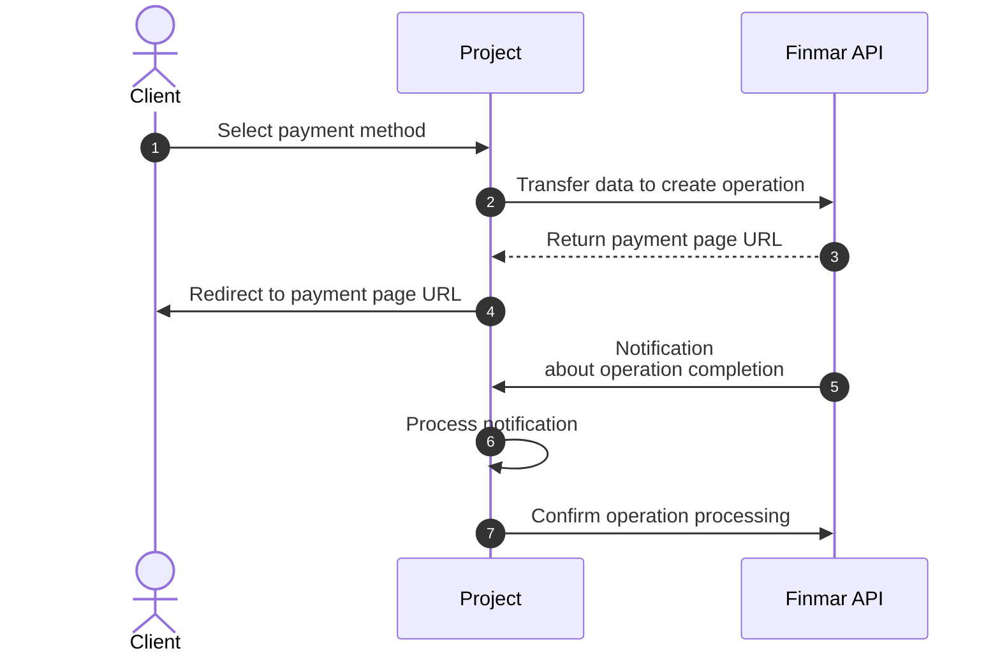

 
 
## General Workflow

 <Note>
  Before starting integration, request a username and password for the test environment in the integration chat.
</Note>

<CardGroup cols={1}>
  <Card title="Integration Documentation" icon="book" horizontal href="/en/api-reference/introduction">
  </Card>  
</CardGroup>
