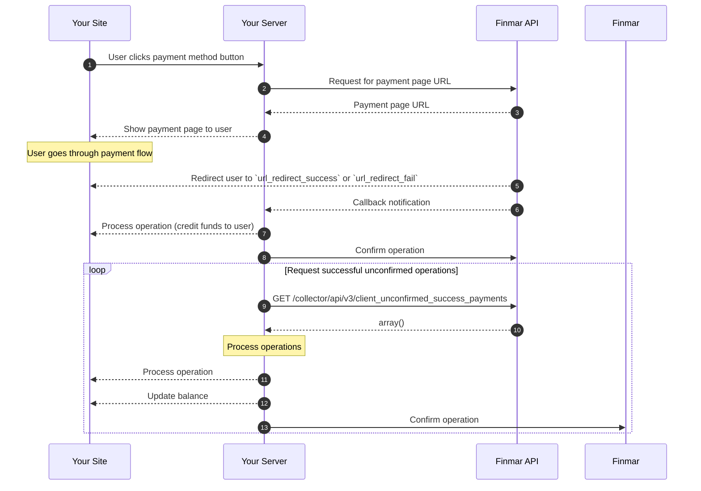

import TestCards from '/en/snippets/test-cards.mdx';

## General Workflow

<Steps>
  <Step title="User initiates payment">
    User clicks the pay button on your site, initiating the interaction process with your server.
  </Step>
  <Step title="Request payment page URL">
    Your server sends a request to Finmar API to obtain a unique link to the payment page.
  </Step>
  <Step title="Receive payment page URL">
    Finmar API interacts with the payment provider and passes the generated payment page link to your server.
  </Step>
  <Step title="Show payment page to user">
    Your server redirects the user to the received payment page, where they complete the payment process.
  </Step>
  <Step title="Redirect user to `url_redirect_success` or `url_redirect_fail`">
    After completing the payment, the payment provider redirects the user back to your site to the predefined URLs (`url_success` or `url_result`).
  </Step>
  <Step title="Callback notification">
    Finmar API sends a notification to your server about the operation status via the specified `url_callback`.
  </Step>
  <Step title="Process operation (credit funds to user)">
    Your server processes the received notification, verifies the signature, credits funds to the user, and confirms receipt of the notification by sending a `POST /api/operation/set_ack_id` request to Finmar.
  </Step>
  <Step title="Confirm operation">
    After successfully processing the operation (crediting funds to the user), your server confirms the operation processing by sending a confirmation request to Finmar API.
  </Step>
  <Step title="Process new successful operations (loop)">
    Your server periodically requests a list of unconfirmed successful operations from Finmar (`GET /collector/api/v3/client_unconfirmed_success_payments`). After receiving and processing these operations, your server confirms the processing of each operation, updates the user's balance on your site, and sets `operation_ack_id` again to prevent duplication. This cycle repeats to process all new successful operations.
  </Step>
</Steps>
 
 <TestCards />

 <Note>
  Before starting integration, request a username and password for the test environment in the integration chat.
</Note>

<CardGroup cols={1}>
  <Card title="Integration Documentation" icon="book" horizontal href="/en/api-reference/introduction">
    Detailed information on creating operations, handling notifications, and confirming payments
  </Card>  
</CardGroup>
