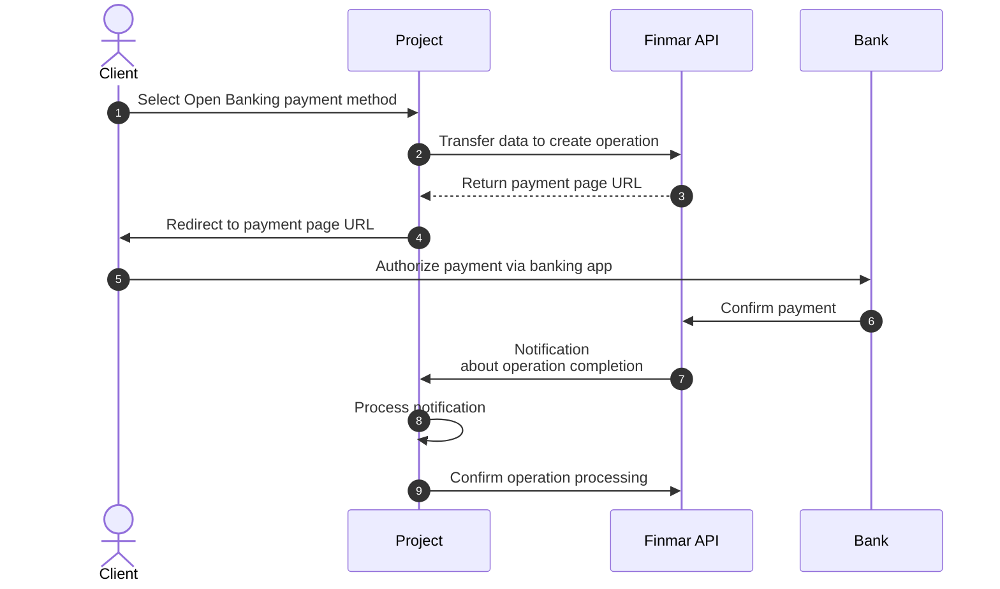

 
 
Open Banking is a technology that allows users to make payments directly from their bank account without using a bank card. The integration supports direct transfers via banking apps.

## General Workflow

<Steps>
  <Step title="Create operation">
    Your server sends a request to Finmar API to create an operation with payment method `openbanking`.
  </Step>
  <Step title="Receive payment page URL">
    Finmar API returns a unique payment page URL with Open Banking support.
  </Step>
  <Step title="Redirect user">
    The user is redirected to the payment page where they select their bank.
  </Step>
  <Step title="Bank authorization">
    The user logs in to their bank's app and confirms the payment.
  </Step>
  <Step title="Receive notification">
    Finmar API sends a notification to your server about the operation status after bank confirmation.
  </Step>
  <Step title="Confirm processing">
    After successfully processing the operation, your server confirms receipt of the notification.
  </Step>
</Steps>

<Note>
  Before starting integration, request a username and password for the test environment in the integration chat.
</Note>

<CardGroup cols={1}>
  <Card title="Integration Documentation" icon="book" horizontal href="/en/api-reference/integration/checkout">
    Detailed information on creating Open Banking operations and request parameters
  </Card>  
</CardGroup>
