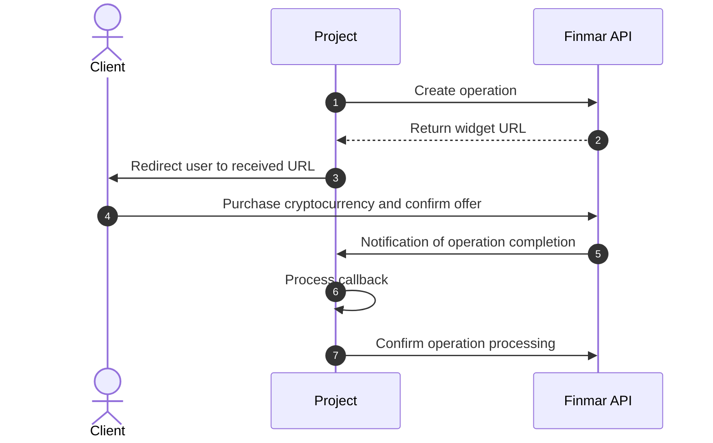

import TestCards from '/en/snippets/test-cards.mdx';
import Callback from '/en/snippets/callback.mdx';

## General Workflow

<Steps>
  <Step title="Create operation">
    The project site sends operation details to Finmar API: client data, amount, and fiat currency.
  </Step>
  <Step title="Return widget URL">
    Finmar API creates a unique widget URL and returns it to the project site.
  </Step>
  <Step title="Redirect user to received URL">
    The project site redirects the client to the received payment URL.
  </Step>
  <Step title="Execute operation">
    The client purchases cryptocurrency and confirms the offer terms in the product interface.

    <Tip>
      When debugging in the sandbox environment, use test cards:
    </Tip>
    <TestCards />
  </Step>
  <Step title="Notification of operation completion">
    Finmar API sends a transaction completion notification to the project site.
  </Step>
  <Step title="Process notification">
    The project site processes the received notification and credits the amount to the user's account.
  </Step>
  <Step title="Confirm processing">
    The project site calls Finmar API method to confirm operation processing.
  </Step>
</Steps>
<Note>
  Before starting integration, request a username and password for the test environment in the integration chat.
</Note>

 <CardGroup cols={1}>
   <Card title="Integration Documentation" icon="book" horizontal href="/en/api-reference/introduction">
  </Card>  
  </CardGroup>
