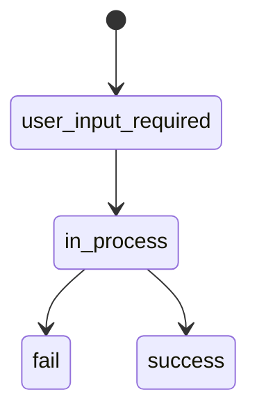

When processing operations, refer to the value of the `current_status` parameter.

A fiat deposit operation has the following status model:

<ParamField path="user_input_required" type="string">
  Waiting for user redirection to the payment page
</ParamField>

<ParamField path="in_process" type="string">
  Operation in process
</ParamField>

<ParamField path="fail" type="string">
  Operation completed unsuccessfully
</ParamField>

<ParamField path="success" type="string">
  Operation completed successfully
</ParamField>

<Warning>
  Do not confuse with `operation_state`
</Warning>
