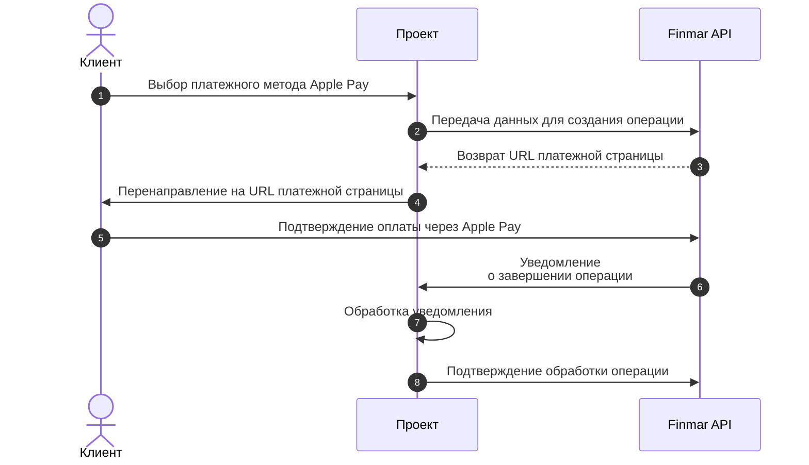

 
 
Apple Pay — это безопасный способ оплаты для пользователей устройств Apple. Интеграция позволяет принимать платежи через Apple Pay с использованием Touch ID, Face ID или пароля.

## Общая схема работы

<Steps>
  <Step title="Создание операции">
    Ваш сервер отправляет запрос в Finmar API для создания операции с методом оплаты `applepay`.
  </Step>
  <Step title="Получение URL платёжной страницы">
    Finmar API возвращает уникальный URL платёжной страницы с поддержкой Apple Pay.
  </Step>
  <Step title="Перенаправление пользователя">
    Пользователь перенаправляется на платёжную страницу, где может выбрать Apple Pay в качестве метода оплаты.
  </Step>
  <Step title="Обработка платежа">
    Пользователь подтверждает оплату через Apple Pay, используя Touch ID, Face ID или пароль.
  </Step>
  <Step title="Получение уведомления">
    Finmar API отправляет уведомление на ваш сервер о статусе операции.
  </Step>
  <Step title="Подтверждение обработки">
    После успешной обработки операции ваш сервер подтверждает получение уведомления.
  </Step>
</Steps>

<Note>
  Перед началом интеграции запросите имя пользователя и пароль для тестового окружения в чате интеграции
</Note>

<CardGroup cols={1}>
  <Card title="Документация по интеграции" icon="book" horizontal href="/api-reference/integration/checkout">
    Подробная информация о создании операций и параметрах запроса
  </Card>  
</CardGroup>