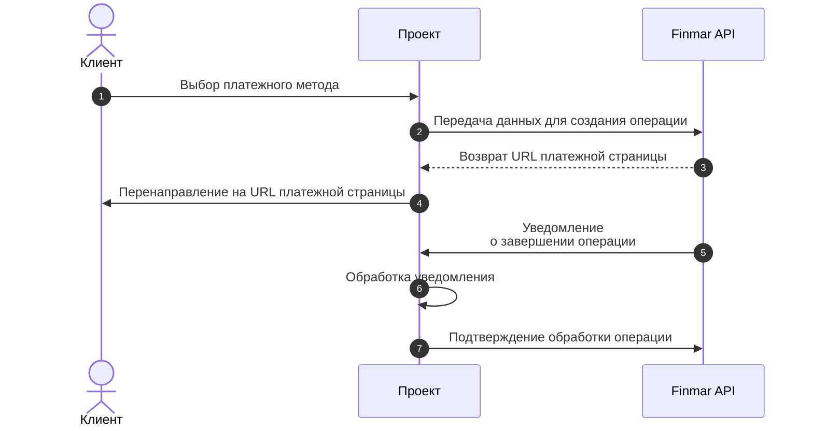

 
 
## Общая схема работы



<Steps>
  <Step title="Выбор платежного виджета">
    Клиент выбирает иконку платежного метода в интерфейсе сайта проекта
  </Step>
  <Step title="Передача данных для создания операции">
    Сайт проекта отправляет в Finmar API реквизиты операции: данные клиента, сумму и валюту в фиате

    <Accordion title="Пример запроса создания" icon="terminal">
      ```bash Запрос создания операции
    curl --location 'https://sandbox.finmar.tech/prepare2/api/v3/checkout' \
--data-raw '{
    "client_operation_id": "W8osiYdUOh091ABzvV",
    "payment_profile": "sandbox",
    "method": "applepay",
    "amount": {
        "amount": "20.10",
        "currency": "EUR"
    },
    "user": {
        "user_id": "u123",
        "email": "globocheck.kyc@gmail.com",
        "email_verified": true
    },
    "url_callback": "https://webhook-test.com/d6357ae34082392a5d35200dbf994b30",
    "url_redirect_success": "https://finmar.requestcatcher.com?success",
    "url_redirect_fail": "https://finmar.requestcatcher.com?fail"
}'
      ```
    </Accordion>
  </Step>
  <Step title="Получение платёжной страницы">
    Finmar API создает уникальный URL и возвращает его сайту проекта

    <Accordion title="Пример ответа" icon="server">
      ```json
   {
    "success": true,
    "result": {
        "url": "https://crypto.cheipho.com/payment-front/8268faad-3ced-4736-ac0d-c8480af31f2f",
        "reference_id": "07724a1b-c0a8-405a-b8e4-5376eb1a3289"
    },
    "trace_id": "8e4ca1791a714991aba47978f7943106"
}
      ```
    </Accordion>
  </Step>
  <Step title="Перенаправление клиента">
    Сайт проекта автоматически перенаправляет клиента на сгенерированный платежный URL
  </Step>
  <Step title="Проведение операции">
    Клиент совершает оплату.
    При отладке на sandbox окружении используйте тестовые суммы `100.10`:

  </Step>
  <Step title="Уведомление о завершении операции">
    Finmar API отправляет сайту проекта уведомление о завершении транзакции. Пример:

    <Accordion title="Пример уведомления" icon="server">
      ```json
         {
            "reference_id": "07724a1b-c0a8-405a-b8e4-5376eb1a3289",
            "client_operation_id": "W8osiYdUOh091ABzvV",
            "result": "complete",
            "deposit": {
                "amount": 20.1,
                "currency": "EUR"
            },
            "meta": {
                "user": {
                    "email": "globocheck.kyc@gmail.com",
                    "user_id": "u123",
                    "email_verified": true
                },
                "amount": {
                    "amount": "20.10",
                    "currency": "EUR"
                },
                "method": "applepay",
                "url_callback": "https://webhook-test.com/d6357ae34082392a5d35200dbf994b30",
                "payment_profile": "sandbox",
                "url_redirect_fail": "https://finmar.requestcatcher.com?fail",
                "client_operation_id": "W8osiYdUOh091ABzvV",
                "url_redirect_success": "https://finmar.requestcatcher.com?success"
            },
            "card": {
                "oper_type": "deposit",
                "initial": {
                    "amount": 20.1,
                    "currency": "EUR"
                },
                "charged": {
                    "amount": 20.1,
                    "currency": "EUR"
                },
                "initial_changed": false,
                "requested_changed": false,
                "card_info": null
            },
            "rates": {
                "EUR-RUB": 91.20875909217102,
                "EUR-USD": 1.156681803776
            },
            "payment_custom_data": {
                "name": "test_applepay"
            },
            "user_id": "u123",
            "current_status": "success",
            "payment_product": "apm",
            "payment_method_type": "fiat",
            "payment_method_code": "000_test_applepay"
        }
      ```

 
    </Accordion>
  </Step>
  <Step title="Обработка уведомления">
   
При обратного уведомления, наиболее значимые параметры:

<ParamField path="user_id" type="string">
  Идентификатор пользователя.
</ParamField>

<ParamField path="current_status" type="string">
  Статус операции. `success`
</ParamField>

<ParamField path="reference_id" type="string">
  Идентификатор операции на стороне сервиса.
</ParamField>
<ParamField path="client_operation_id" type="string">
  Идентификатор операции вызвающей стороны. 
</ParamField>
<ParamField path="deposit.amount" type="string">
  Сумма полученная от пользователя.
</ParamField>
<ParamField path="deposit.currency" type="string">
Валюта операции.
</ParamField>

<ParamField path="payment_method_type" type="string">
  Тип операции. `fiat`
</ParamField>

<ParamField path="payment_method_product" type="string">
  Платёжный продукт. `apm`
</ParamField>

<ParamField path="payment_method_code" type="string">
  Код пплатёжного метода. `000_test_applepay`
</ParamField>

  </Step>

  <Step title="Подтверждение обработки">
  После успешной обработки операции, необходимо подтвердить её обработку, используя метод [/collector/api/v3/client_confirm_payment_by_reference_id](/api-reference/фиатные-платежи/подтвердить-операцию-по-reference_id)
  </Step>

</Steps>