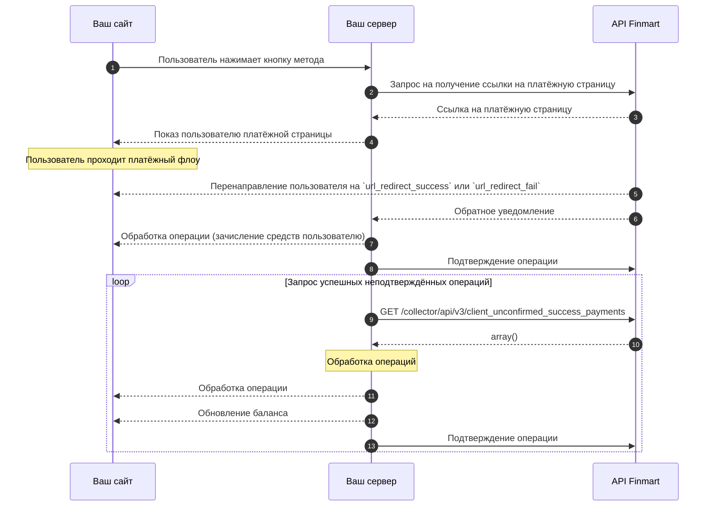

import TestCards from '/snippets/test-cards.mdx';

## Общая схема работы

<Steps>
  <Step title="Инициирование оплаты пользователем">
    Пользователь нажимает кнопку оплаты на вашем сайте, инициируя процесс взаимодействия с вашим сервером.
  </Step>
  <Step title="Запрос ссылки на платёжную страницу">
    Ваш сервер отправляет запрос к API Finmart для получения уникальной ссылки на платёжную страницу.
  </Step>
  <Step title="Получение ссылки на платёжную страницу">
    API Finmart взаимодействует с платёжным провайдером и передаёт вашему серверу сгенерированную ссылку на платёжную страницу.
  </Step>
  <Step title="Показ пользователю платёжной страницы">
    Ваш сервер перенаправляет пользователя на полученную платёжную страницу, где он проходит процесс оплаты.
  </Step>
  <Step title="Перенаправление пользователя на `url_redirect_success` или `url_redirect_fail`">
    После завершения платежа платёжный провайдер перенаправляет пользователя обратно на ваш сайт по заранее определённым URL-адресам (`url_success` или `url_result`).
  </Step>
  <Step title="Обратное уведомление">
    API Finmart отправляет уведомление на ваш сервер о статусе операции через указанный `url_callback`.
  </Step>
  <Step title="Обработка операции (зачисление средств пользователю)">
    Ваш сервер обрабатывает полученное уведомление, проверяет подпись, зачисляет средства пользователю и подтверждает получение уведомления, отправляя запрос `POST /api/operation/set_ack_id` в Finmart.
  </Step>
  <Step title="Подтверждение операции">
    После успешной обработки операции (зачисления средств пользователю) ваш сервер подтверждает обработку операции, отправляя запрос на подтверждение в Finmart API.
  </Step>
  <Step title="Обработка новых успешных операций (цикл)">
    Ваш сервер периодически запрашивает у Finmart список неподтверждённых успешных операций (`GET /collector/api/v3/client_unconfirmed_success_payments`). После получения и обработки этих операций ваш сервер подтверждает обработку каждой операции, обновляет баланс пользователя на вашем сайте и снова устанавливает `operation_ack_id` для предотвращения дублирования. Этот цикл повторяется для обработки всех новых успешных операций.
  </Step>
</Steps>
 
 <TestCards />

 <Note>
  Перед началом интеграции запросите имя пользователя и пароль для тестового окружения в чате интеграции
</Note>

<CardGroup cols={1}>
  <Card title="Документация по интеграции" icon="book" horizontal href="/api-reference/introduction">
    Подробная информация о создании операций, обработке уведомлений и подтверждении платежей
  </Card>  
</CardGroup>

 