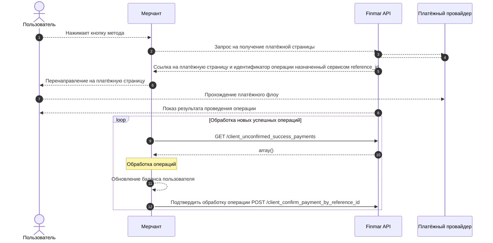

 

### Работа через запрос списка операций

```mermaid
sequenceDiagram
  actor user as Пользователь
  participant merchant as Мерчант
  participant finmar as Finmar API
  participant payment as Платёжный провайдер

  autonumber
  user -->> merchant: Нажимает кнопку метода
  merchant -->> finmar: Запрос на получение платёжной страницы
  finmar -->> payment: 
  payment --> finmar: 
  finmar -->>+ merchant: Ссылка на платёжную страницу и идентификатор операции назначенный сервисом reference_id
  merchant -->> user: Перенаправление на платёжную страницу
  user -->> payment: Прохождение платёжного флоу
  finmar -->> user: Показ результата проведения операции

   loop Обработка новых успешных операций
		    merchant->>finmar: GET /client_unconfirmed_success_payments 
		    finmar-->>merchant: array()
	     note over merchant: Обработка операций
         merchant -->>merchant: Обновление баланса пользователя
        merchant->>finmar: Подтвердить обработку операции POST /client_confirm_payment_by_reference_id 

    end
```
 
...