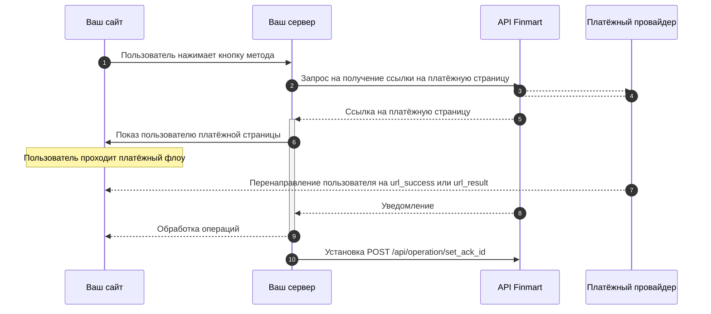
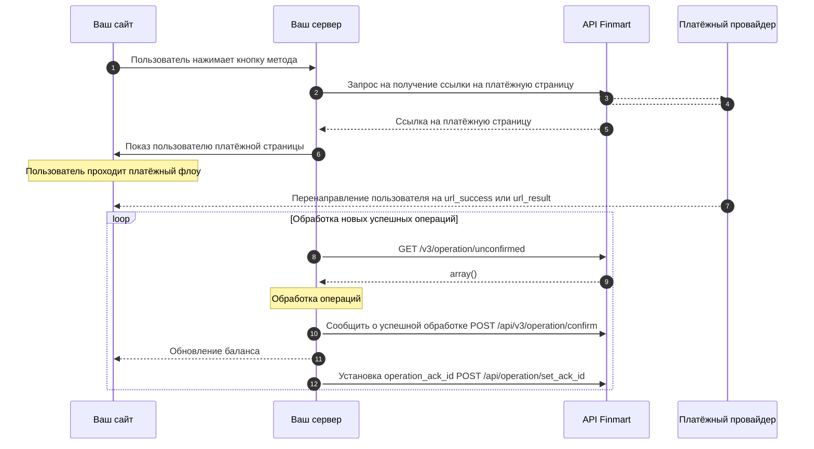

## {title}


## Возможные схемы взаимодействия

### Работа по колбекам





<Steps>
  <Step title="Оператор отправляет запрос на создание операции и перенаправляет пользователя на полученный URL">
    desc
  </Step>
  <Step title="Пользователь подтверждает операцию">
    desc
  </Step>
  <Step title="Оператор получает уведомление о завершении операции">
    desc
  </Step>
  <Step title="Оператор выполняет проверку подлинности уведомления">
    Тут ссыль на описание алгоритмов проверки
  </Step>
  <Step title="Оператор выполняет обработку операции">
    Ссыль на метод set_operation_ack_id
  </Step>
</Steps>


### Работа через запрос списка операций



 


<Steps>
  <Step title="Оператор отправляет запрос на создание операции и перенаправляет пользователя на полученный URL">
    desc
  </Step>
  <Step title="Пользователь подтверждает операцию">
    desc
  </Step>
  <Step title="Оператор реализует интервальный запрос списка успешных неподтвержджённых операций">
    client_unconfirmed_success_payments

    
  </Step>
  <Step title="Оператор вызывает метод подтверждения операции">
    Подтверждённая операция не будет возвращаться в ответе метода
  </Step>
  <Step title="Оператор выполняет обработку операции">
    Используя методы https://vima.mintlify.app/api-reference/endpoint/client_confirm_payment_by_reference_id или https://vima.mintlify.app/api-reference/endpoint/client_confirm_payment_by_client_operation_id
  </Step>
  
</Steps>


<Expandable>
  
</Expandable>

<Expandable>
  ```bash Response
  {
      "success": true,
      "result": {
          "url": "https://card.cheipho.com/transaction/6e89d40d-3fda-42a2-9c97-3564c8443c3a",
          "reference_id": "6e89d40d-3fda-42a2-9c97-3564c8443c3a"
      },
      "trace_id": "8abfc59b1bd149b9a3e56e0226a4c796"
  }
  ```
</Expandable>

...