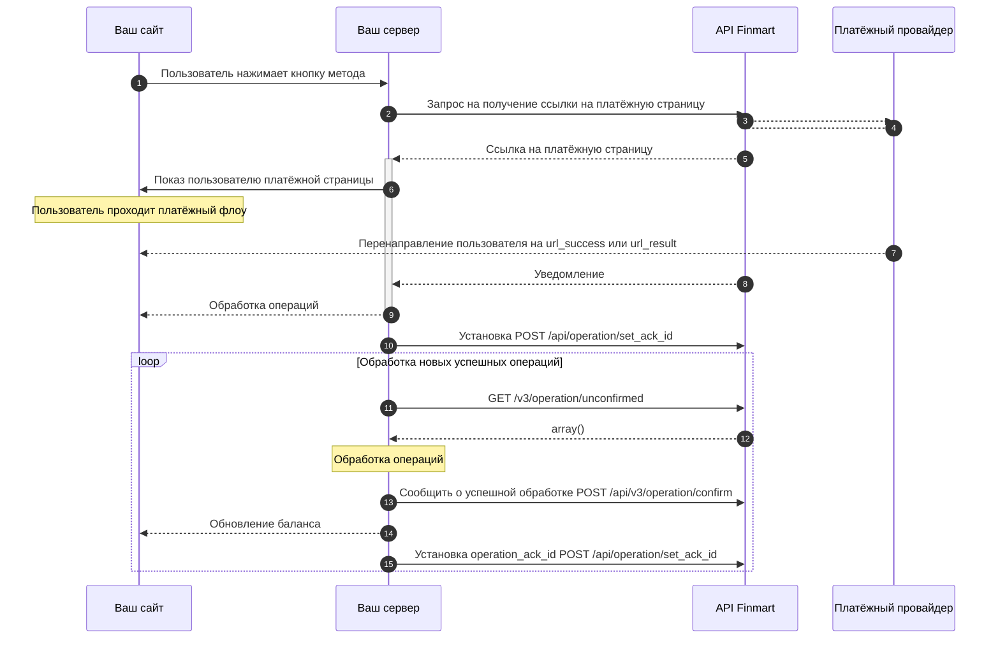

## {{title}}





## Возможные схемы взаимодействия

### Работа по колбекам

<Steps>
  <Step title="Оператор отправляет запрос на создание операции и перенаправляет пользователя на полученный URL">
    
  </Step>
  <Step title="Пользователь вводит данные карты">
    
  </Step>
  <Step title="3ds-подтверждение платежа">
    
  </Step>
  <Step title="Оператор получает уведомление о завершении платежа на переданный url_callback">
    
  </Step>
  <Step title="New Step">
    
  </Step>
</Steps>

<Expandable>
  
</Expandable>

<Expandable>
  ```bash Response
  {
      "success": true,
      "result": {
          "url": "https://card.cheipho.com/transaction/6e89d40d-3fda-42a2-9c97-3564c8443c3a",
          "reference_id": "6e89d40d-3fda-42a2-9c97-3564c8443c3a"
      },
      "trace_id": "8abfc59b1bd149b9a3e56e0226a4c796"
  }
  ```
</Expandable>

...


