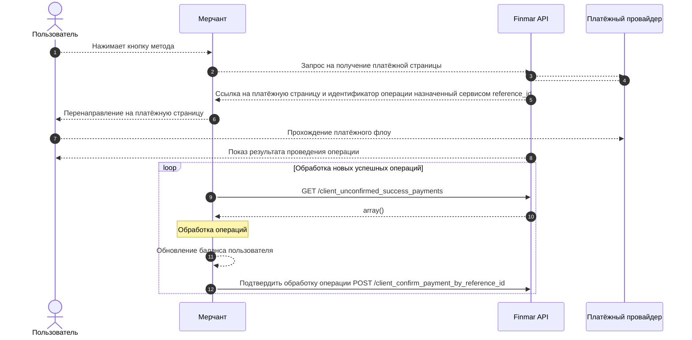

## Основные схемы взаимодействия

### Работа по колбекам

<Steps>
  <Step title="Пользователь выбирает платёжный метод">
     
  </Step>
  <Step title="Оператор подтверждает операцию">
 
  </Step>
  <Step title="Оператор получает уведомление о завершении операции">
   
  </Step>
  <Step title="Оператор выполняет проверку подлинности уведомления">
   
  </Step>
  <Step title="Оператор выполняет обработку операции">
 
  </Step>
</Steps>


### Работа через запрос списка операций




<Steps>
  <Step title="Оператор отправляет запрос на создание операции и перенаправляет пользователя на полученный URL">
    desc
  </Step>
  <Step title="Пользователь подтверждает операцию и перенаправляется на URL-возврата">
 
  </Step>
  
  <Step title="Оператор реализует интервальный запрос списка успешных неподтвержджённых операций">

Пример запроса:    
```bash Получение списка успешных неподтверждённых операций
curl --location 'https://sandbox.finmar.tech/collector/api/v3/client_unconfirmed_success_payments'
```

  </Step>

  <Step title="Оператор выполняет обработку операции">
    Используя методы https://vima.mintlify.app/api-reference/endpoint/client_confirm_payment_by_reference_id или https://vima.mintlify.app/api-reference/endpoint/client_confirm_payment_by_client_operation_id
  </Step>
    <Step title="Оператор вызывает метод подтверждения операции">

  После успешной обработки операции, необходимо подтвердить её обработку, используя методы [/collector/api/v3/client_confirm_payment_by_reference_id](/api-reference/фиатные-платежи/подтвердить-операцию-по-reference_id) или 
  [/collector/api/v3/client_confirm_payment_by_client_operation_id](/api-reference/фиатные-платежи/подтвердить-операцию-по-client_operation_id)

  </Step>
</Steps>

 
...