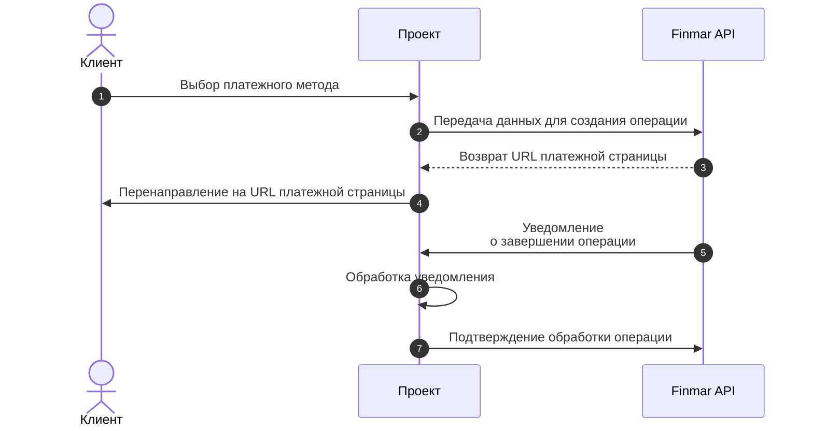

 
 
## Общая схема работы

 
 
 <Note>
  Перед началом интеграции запросите имя пользователя и пароль для тестового окружения в чате интеграции
</Note>

 <CardGroup cols={1}>
   <Card title="Документация по интеграции" icon="book" horizontal href="api-reference/integration/checkout#openbanking">
  </Card>  

</CardGroup>

