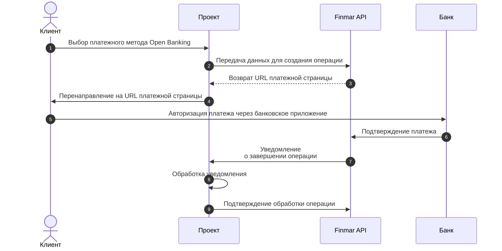

 
 
Open Banking — это технология, позволяющая пользователям совершать платежи напрямую со своего банковского счёта без использования банковской карты. Интеграция поддерживает прямые переводы через банковские приложения.

## Общая схема работы

<Steps>
  <Step title="Создание операции">
    Ваш сервер отправляет запрос в Finmar API для создания операции с методом оплаты `openbanking`.
  </Step>
  <Step title="Получение URL платёжной страницы">
    Finmar API возвращает уникальный URL платёжной страницы с поддержкой Open Banking.
  </Step>
  <Step title="Перенаправление пользователя">
    Пользователь перенаправляется на платёжную страницу, где выбирает свой банк.
  </Step>
  <Step title="Авторизация в банке">
    Пользователь авторизуется в приложении своего банка и подтверждает платёж.
  </Step>
  <Step title="Получение уведомления">
    Finmar API отправляет уведомление на ваш сервер о статусе операции после подтверждения банком.
  </Step>
  <Step title="Подтверждение обработки">
    После успешной обработки операции ваш сервер подтверждает получение уведомления.
  </Step>
</Steps>

<Note>
  Перед началом интеграции запросите имя пользователя и пароль для тестового окружения в чате интеграции
</Note>

<CardGroup cols={1}>
  <Card title="Документация по интеграции" icon="book" horizontal href="/api-reference/integration/checkout">
    Подробная информация о создании операций Open Banking и параметрах запроса
  </Card>  
</CardGroup>

