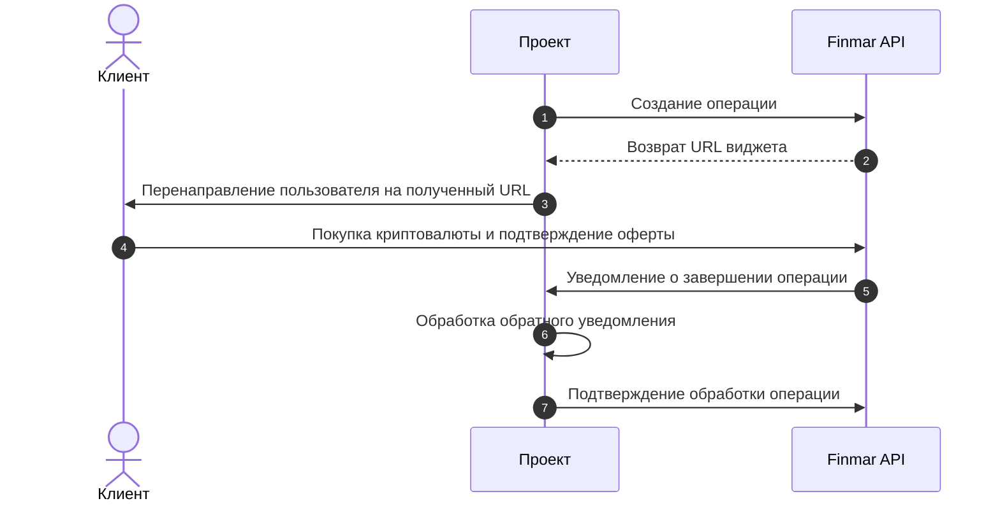

import TestCards from '/snippets/test-cards.mdx';
import Callback from '/snippets/callback.mdx';

## Общая схема работы

<Steps>
  <Step title="Создание операции">
    Сайт проекта отправляет в Finmar API реквизиты операции: данные клиента, сумму и валюту в фиате.
  </Step>
  <Step title="Возврат URL виджета">
    Finmar API создает уникальный URL виджета и возвращает его сайту проекта.
  </Step>
  <Step title="Перенаправление пользователя на полученный URL">
    Сайт проекта перенаправляет клиента на полученный платежный URL.
  </Step>
  <Step title="Проведение операции">
    Клиент совершает покупку криптовалюты и подтверждает условия оферты в интерфейсе продукта. 

    <Tip>
      При отладке на sandbox окружении используйте тестовые карты:
    </Tip>
    <TestCards />
  </Step>
  <Step title="Уведомление о завершении операции">
    Finmar API отправляет сайту проекта уведомление о завершении транзакции.
  </Step>
  <Step title="Обработка уведомления">
    Сайт проекта обрабатывает полученное уведомление и зачисляет полученную сумму на счёт пользователя.
  </Step>
  <Step title="Подтверждение обработки">
    Сайт проекта вызывает метод Finmar API для подтверждения обработки операции.
  </Step>
</Steps>
<Note>
  Перед началом интеграции запросите имя пользователя и пароль для тестового окружения в чате интеграции
</Note>

 <CardGroup cols={1}>
   <Card title="Документация по интеграции" icon="book" horizontal href="/api-reference/introduction">
  </Card>  
  </CardGroup>