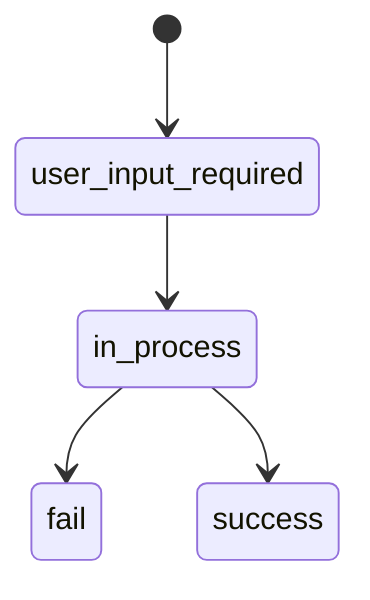

При обработке операций следует руководствоваться значением параметра `current_status`

Фиатная операция депозита имеет следующую статусную модель:

<ParamField path="user_input_required" type="string">
  Ожидание направления пользователя на платёжную страницу
</ParamField>

<ParamField path="in_process" type="string">
  Операция в процессе
</ParamField>

<ParamField path="fail" type="string">
  Операция завершилась неуспешно
</ParamField>

<ParamField path="success" type="string">
  Операция завершилась успешно
</ParamField>

<Warning>
  Не путать с `operation_state` 
</Warning>